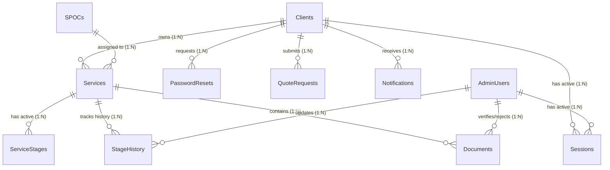

# 📊 Legal Sthal Master Database Schema Specification

**Document Version:** 1.0.0  
**Storage Engine:** Google Sheets Database (Relational abstraction via Apps Script Repository)  
**File Name:** `Legal Sthal Master Database`  
**Collation / Encoding:** UTF-8  

---

## 1. Relational Architecture Overview

The database uses Google Sheets as a low-cost, zero-maintenance relational data store. To ensure strict data integrity, all row lookups and insertions are handled via a centralized **Header-Mapped Sheet Repository** with Apps Script concurrency locks (`LockService.getScriptLock()`).

---

## 2. Table Specifications

### 2.1 `Clients`
* **Purpose:** Stores authenticated client profiles, business details, login credentials, and account lockout security state.
* **Business Rule:** ONE Client Account owns N Services. Client records are never duplicated upon purchasing additional services.
* **Primary Key:** `client_id` (e.g. `CL001`)
* **Foreign Keys:** None

| Column Name | Data Type | Constraint | Description |
| :--- | :--- | :--- | :--- |
| `client_id` | String | PK, Required, Unique | Formatted client identifier (`CL` + 3-digit padded number). |
| `name` | String | Required | Official company name / legal entity name. |
| `contact_name` | String | Required | Primary representative/contact person name. |
| `email` | String | Required, Normalized | Primary contact & login email (lowercase, trimmed). |
| `mobile` | String | Required, Normalized | Primary 10-digit mobile number (e.g., `+919876543210`). |
| `login_id` | String | Required, Unique | Client portal login username (defaults to normalized email). |
| `password_hash` | String | Required | Salted SHA-256 / PBKDF2 cryptographic hash of password. |
| `password_salt` | String | Required | 16-byte cryptographically secure random hexadecimal salt. |
| `first_login` | Boolean | Required | `TRUE` if temporary credentials are active; requires reset. |
| `status` | String | Required | Account state: `ACTIVE`, `LOCKED`, `SUSPENDED`. |
| `failed_attempts` | Integer | Required | Failed login counter (0 to 5). Resets on success. |
| `locked_until` | ISO Timestamp | Optional | Unlock timestamp if account is temporarily locked. |
| `last_login` | ISO Timestamp | Optional | Timestamp of most recent successful authentication. |
| `password_changed_at` | ISO Timestamp | Optional | Timestamp when password was last updated. |
| `state` | String | Optional | State of incorporation / operations (e.g., "Gujarat"). |
| `address` | String | Optional | Registered office address. |
| `gstin` | String | Optional | 15-digit GST identification number if applicable. |
| `created_at` | ISO Timestamp | Required | Account creation timestamp. |
| `updated_at` | ISO Timestamp | Required | Last profile modification timestamp. |

* **Search Strategy:**
  - In-memory hash map index on `email` and `mobile` built during repository lookup to guarantee O(1) duplicate detection.

---

### 2.2 `Services`
* **Purpose:** Core service engagement records purchased by clients, tracking financial totals, SPOC assignments, and active stage status.
* **Primary Key:** `service_id` (e.g. `SRV001`)
* **Foreign Keys:** `client_id` (references `Clients.client_id`), `spoc_id` (references `SPOCs.spoc_id`)

| Column Name | Data Type | Constraint | Description |
| :--- | :--- | :--- | :--- |
| `service_id` | String | PK, Required, Unique | Service identifier (`SRV` + 3-digit padded number). |
| `client_id` | String | FK, Required | Parent client owner. |
| `service_code` | String | Required, Unique | Human-readable service code (e.g. `INC-2026-001`). |
| `crm_deal_id` | String | Optional | External Zoho CRM Deal record identifier (e.g. `ZC-890124`). |
| `service_name` | String | Required | Service title (e.g. "Company Incorporation"). |
| `company_type` | String | Required | Entity category: `Private Limited`, `LLP`, `Proprietorship`. |
| `state` | String | Required | Jurisdiction state for filing (e.g. "Gujarat"). |
| `total_amount` | Decimal | Required | Total contract value (in INR). |
| `paid_amount` | Decimal | Required | Cumulative amount received (in INR). |
| `remaining_amount` | Decimal | Required | Calculated: `total_amount - paid_amount`. |
| `dsc_count` | Integer | Required | Number of Digital Signature Certificates needed (default: 2). |
| `current_stage` | String | Required | Human-readable name of current stage (e.g. "DSC Creation"). |
| `current_stage_index` | Integer | Required | 0-based index of active stage within workflow. |
| `progress_percentage` | Integer | Required | Calculated percentage (0–100%). |
| `status` | String | Required | Overall state: `In Progress`, `Under Review`, `Completed`. |
| `spoc_id` | String | FK, Optional | Assigned Single Point of Contact (e.g. `SPOC001`). |
| `certificate_url` | String | Optional | Google Drive URL to finalized certificate/incorporation kit. |
| `completed_on` | ISO Timestamp | Optional | Date when service was formally completed. |
| `created_at` | ISO Timestamp | Required | Onboarding timestamp. |
| `updated_at` | ISO Timestamp | Required | Timestamp of last modification. |

* **Search Strategy:**
  - Multi-key filter on `client_id` to quickly fetch all services belonging to a client session.

---

### 2.3 `ServiceStages`
* **Purpose:** Represents the sequential operational stages defined for an active service instance.
* **Primary Key:** `stage_id` (e.g. `STG_SRV001_1`)
* **Foreign Keys:** `service_id` (references `Services.service_id`)

| Column Name | Data Type | Constraint | Description |
| :--- | :--- | :--- | :--- |
| `stage_id` | String | PK, Required | Unique stage identifier (`STG_{serviceId}_{sequence}`). |
| `service_id` | String | FK, Required | Parent service identifier. |
| `stage_name` | String | Required | Name of stage (e.g. "RUN (Name Approval)"). |
| `stage_status` | String | Required | Status: `COMPLETED`, `CURRENT`, `PENDING`. |
| `completed_on` | String | Optional | Completion date string (e.g. "28 Sep 2026"). |
| `description` | String | Optional | Human-readable explanation of deliverables in this stage. |
| `sequence_order` | Integer | Required | 1-based order of stage in workflow sequence. |

---

### 2.4 `StageHistory` (New Tab)
* **Purpose:** Immutable audit log for every stage transition, capturing actor, timestamps, and remarks to prevent non-traceable overwrites.
* **Primary Key:** `stage_history_id` (e.g. `STGH_1727821200000_1`)
* **Foreign Keys:** `service_id` (references `Services.service_id`), `changed_by` (references `AdminUsers.admin_id` or `Clients.client_id`)

| Column Name | Data Type | Constraint | Description |
| :--- | :--- | :--- | :--- |
| `stage_history_id` | String | PK, Required | Unique history record ID. |
| `service_id` | String | FK, Required | Target service identifier. |
| `stage_name` | String | Required | Stage entered or completed. |
| `status` | String | Required | `COMPLETED`, `REVERTED`, `INITIATED`. |
| `changed_by` | String | Required | ID of user who enacted change (`ADM001`, `SYSTEM`). |
| `changed_by_role` | String | Required | Role of actor: `SUPER_ADMIN`, `ADMIN`, `SYSTEM`. |
| `changed_at` | ISO Timestamp | Required | Exact UTC timestamp of change. |
| `remarks` | String | Optional | Operational comments or notes on this transition. |

---

### 2.5 `Documents`
* **Purpose:** Tracks document requirements, Google Form/Direct submissions, Google Drive file linkages, and Admin review/verification status.
* **Primary Key:** `document_id` (e.g. `DOC001`)
* **Foreign Keys:** `service_id` (references `Services.service_id`), `client_id` (references `Clients.client_id`)

| Column Name | Data Type | Constraint | Description |
| :--- | :--- | :--- | :--- |
| `document_id` | String | PK, Required | Unique document identifier. |
| `service_id` | String | FK, Required | Associated service engagement. |
| `client_id` | String | FK, Required | Document owner client ID. |
| `document_name` | String | Required | Title of document (e.g. "PAN Card of Directors"). |
| `document_type` | String | Required | Category: `IDENTITY_PROOF`, `ADDRESS_PROOF`, `NOC`, etc. |
| `form_response_id` | String | Optional | Google Form response identifier if submitted via form. |
| `file_name` | String | Optional | Uploaded filename. |
| `file_url` | String | Required | Restricted Google Drive file view URL. |
| `drive_file_id` | String | Required | Direct Google Drive File ID. |
| `status` | String | Required | State: `Pending`, `Under Review`, `Verified`, `Rejected`. |
| `rejection_reason` | String | Optional | Admin comments detailing reason for rejection. |
| `required` | Boolean | Required | `TRUE` if mandatory for service completion. |
| `uploaded_at` | ISO Timestamp | Optional | Submission timestamp. |
| `verified_at` | ISO Timestamp | Optional | Verification timestamp. |
| `verified_by` | String | Optional | Admin ID who verified the document. |
| `rejected_at` | ISO Timestamp | Optional | Rejection timestamp. |
| `rejected_by` | String | Optional | Admin ID who rejected the document. |

---

### 2.6 `AdminUsers` (New Tab)
* **Purpose:** Stores internal staff credentials, roles, and administrative access privileges.
* **Primary Key:** `admin_id` (e.g. `ADM001`)
* **Foreign Keys:** None

| Column Name | Data Type | Constraint | Description |
| :--- | :--- | :--- | :--- |
| `admin_id` | String | PK, Required | Administrative staff identifier. |
| `name` | String | Required | Full name of admin / team member. |
| `email` | String | Required, Unique | Staff email address (normalized). |
| `password_hash` | String | Required | Salted cryptographic password hash. |
| `password_salt` | String | Required | Cryptographic random hex salt. |
| `role` | String | Required | Role: `SUPER_ADMIN`, `ADMIN`, `TEAM_MEMBER`. |
| `status` | String | Required | State: `ACTIVE`, `INACTIVE`, `LOCKED`. |
| `failed_attempts` | Integer | Required | Failed login attempt counter. |
| `locked_until` | ISO Timestamp | Optional | Account lockout expiration timestamp. |
| `last_login` | ISO Timestamp | Optional | Timestamp of last login. |
| `created_at` | ISO Timestamp | Required | Creation timestamp. |
| `updated_at` | ISO Timestamp | Required | Modification timestamp. |

---

### 2.7 `Sessions` (New Tab)
* **Purpose:** Server-side state store for active login tokens, enabling strict session validation and instant revocation upon logout.
* **Primary Key:** `session_id` (e.g. `SESS_1727821200000_1`)
* **Foreign Keys:** `user_id` (references `Clients.client_id` or `AdminUsers.admin_id`)

| Column Name | Data Type | Constraint | Description |
| :--- | :--- | :--- | :--- |
| `session_id` | String | PK, Required | Unique session record identifier. |
| `token_hash` | String | Required, Indexed | SHA-256 hash of the bearer session token. |
| `user_id` | String | FK, Required | Authenticated user identifier (`CL...` or `ADM...`). |
| `role` | String | Required | Authenticated role: `CLIENT`, `ADMIN`, etc. |
| `client_id` | String | Optional | Populated if user is a client (for quick tenant filtering). |
| `created_at` | ISO Timestamp | Required | Session creation time. |
| `expires_at` | ISO Timestamp | Required | Session expiry timestamp (TTL: default 60 minutes). |
| `last_activity` | ISO Timestamp | Required | Last API invocation time using this session. |
| `status` | String | Required | State: `ACTIVE`, `REVOKED`, `EXPIRED`. |

---

### 2.8 `PasswordResets` (New Tab)
* **Purpose:** Single-use cryptographic reset tokens with strict expiry for secure password recovery.
* **Primary Key:** `reset_id` (e.g. `RST_1727821200000_1`)
* **Foreign Keys:** `user_id` (references `Clients.client_id` or `AdminUsers.admin_id`)

| Column Name | Data Type | Constraint | Description |
| :--- | :--- | :--- | :--- |
| `reset_id` | String | PK, Required | Unique reset request record ID. |
| `user_id` | String | FK, Required | Client or Admin user ID. |
| `token_hash` | String | Required | SHA-256 hash of reset token dispatched to user email. |
| `created_at` | ISO Timestamp | Required | Creation timestamp. |
| `expires_at` | ISO Timestamp | Required | Expiration timestamp (default: 30 minutes). |
| `used` | Boolean | Required | `TRUE` once successfully consumed. |
| `used_at` | ISO Timestamp | Optional | Consumption timestamp. |

---

### 2.9 `SPOCs`
* **Purpose:** Single Point of Contact directory mapping legal experts and relationship executives to client services.
* **Primary Key:** `spoc_id` (e.g. `SPOC001`)
* **Foreign Keys:** None

| Column Name | Data Type | Constraint | Description |
| :--- | :--- | :--- | :--- |
| `spoc_id` | String | PK, Required | Unique SPOC ID. |
| `name` | String | Required | Full name of expert. |
| `title` | String | Required | Designation (e.g. "Senior Incorporation Expert"). |
| `mobile` | String | Required | Contact mobile number. |
| `email` | String | Required | Contact email. |
| `assigned_clients`| Integer | Required | Count of actively assigned client accounts. |
| `status` | String | Required | `Active` or `Inactive`. |
| `avatar_url` | String | Optional | Portrait URL. |
| `created_at` | ISO Timestamp | Optional | Creation date. |
| `updated_at` | ISO Timestamp | Optional | Update date. |

---

### 2.10 `QuoteRequests`
* **Purpose:** Tracks service inquiries, proposal requests, pricing quotes, and negotiations.
* **Primary Key:** `request_id` (e.g. `QR001`)
* **Foreign Keys:** `client_id` (references `Clients.client_id`)

| Column Name | Data Type | Constraint | Description |
| :--- | :--- | :--- | :--- |
| `request_id` | String | PK, Required | Unique quote request identifier. |
| `client_id` | String | FK, Required | Inquiring client ID. |
| `client_name` | String | Required | Name of company / contact person. |
| `service_name` | String | Required | Name of requested service. |
| `company_type` | String | Optional | Entity structure. |
| `state` | String | Optional | Jurisdiction state. |
| `mobile` | String | Required | Inquirer phone number. |
| `email` | String | Required | Inquirer email. |
| `requested_on` | ISO Timestamp | Required | Submission date. |
| `status` | String | Required | `Requested`, `Quote Sent`, `Accepted`, `Declined`. |
| `quote_amount` | String | Optional | Quoted price string (e.g. "₹12,500"). |
| `remarks` | String | Optional | Operational or pricing notes. |

---

### 2.11 `Notifications`
* **Purpose:** Activity and alert feed displayed in the portal and dispatched to email/SMS/WhatsApp.
* **Primary Key:** `notification_id` (e.g. `NTF001`)
* **Foreign Keys:** `client_id` (references `Clients.client_id`)

| Column Name | Data Type | Constraint | Description |
| :--- | :--- | :--- | :--- |
| `notification_id`| String | PK, Required | Unique notification ID. |
| `client_id` | String | FK, Required | Recipient client ID. |
| `client_name` | String | Required | Name of client entity. |
| `event_type` | String | Required | Category: `Stage Updated`, `Document Rejected`, `Payment Received`, `Login Created`. |
| `details` | String | Required | Notification message body. |
| `channel` | String | Required | Delivery channel: `Email`, `WhatsApp`, `SMS`, `Portal`. |
| `date` | ISO Timestamp | Required | Timestamp of event. |
| `status` | String | Required | `Delivered`, `Pending`, `Failed`. |

---

### 2.12 `AuditLogs`
* **Purpose:** Immutable compliance and forensic log for all sensitive actions and administrative overrides.
* **Primary Key:** `log_id` (e.g. `LOG_1727821200000_1`)
* **Foreign Keys:** `actor_id` (references `Clients.client_id` or `AdminUsers.admin_id`)

| Column Name | Data Type | Constraint | Description |
| :--- | :--- | :--- | :--- |
| `log_id` | String | PK, Required | Unique log record ID. |
| `timestamp` | ISO Timestamp | Required | Exact time of event. |
| `actor_id` | String | Required | User who performed action (`ADM001`, `CL001`, `SYSTEM`). |
| `actor_role` | String | Required | `SUPER_ADMIN`, `ADMIN`, `CLIENT`, `SYSTEM`. |
| `action` | String | Required | Action code: `LOGIN_SUCCESS`, `STAGE_UPDATED`, etc. |
| `entity_type` | String | Required | Target entity: `CLIENT`, `SERVICE`, `DOCUMENT`, `SESSION`. |
| `entity_id` | String | Required | Target primary key. |
| `ip_or_metadata` | String | Optional | Client User-Agent / context metadata. |
| `details` | String | Optional | JSON string of sanitized parameter diffs. |

---

### 2.13 `CRMSyncLogs` (New Tab)
* **Purpose:** Tracks synchronization attempts between Legal Sthal Google Sheets and Zoho CRM, enabling automatic retry of failed webhook/API jobs.
* **Primary Key:** `sync_id` (e.g. `SYNC001`)
* **Foreign Keys:** `entity_id` (references `Clients.client_id` or `Services.service_id`)

| Column Name | Data Type | Constraint | Description |
| :--- | :--- | :--- | :--- |
| `sync_id` | String | PK, Required | Unique sync record ID. |
| `entity_type` | String | Required | `Client`, `Deal`, `Stage`, `Document`. |
| `entity_id` | String | FK, Required | ID of entity being synchronized. |
| `crm_id` | String | Optional | Zoho CRM Lead / Deal / Contact ID. |
| `operation` | String | Required | `UPSERT_LEAD`, `UPDATE_DEAL_STAGE`, `SYNC_PAYMENT`. |
| `status` | String | Required | `Synced`, `Failed`, `Pending Retry`. |
| `attempt_count` | Integer | Required | Number of delivery attempts made (1 to 5). |
| `last_error` | String | Optional | Error response payload from Zoho CRM API. |
| `synced_at` | ISO Timestamp | Required | Timestamp of last sync attempt. |

---

## 3. Idempotent Migration Mapping Table

When running `migrateDatabase()`, existing data is preserved and backfilled according to this mapping:

| Existing Sheet | Existing Column | Migrated Column | Migration Transformation Rule |
| :--- | :--- | :--- | :--- |
| `Clients` | `Client ID` | `client_id` | Preserved verbatim. |
| `Clients` | `Company Name` | `name` | Preserved verbatim. |
| `Clients` | `Contact Person` | `contact_name` | Preserved verbatim. |
| `Clients` | `Email` | `email` | `trim().toLowerCase()`. |
| `Clients` | `Mobile` | `mobile` | Sanitized phone string. |
| `Clients` | *None* | `login_id` | Backfilled with normalized `email`. |
| `Clients` | `Password` | `password_hash` & `password_salt` | Existing plaintext hashed with new secure random salt. |
| `Clients` | *None* | `first_login` | Set to `FALSE` for existing clients, `TRUE` for new. |
| `Clients` | *None* | `failed_attempts` | Initialized to `0`. |
| `Clients` | *None* | `locked_until` | Initialized to blank `""`. |
| `Services` | *None* | `crm_deal_id` | Initialized to blank `""` or matched to existing records. |
| `Services` | *None* | `dsc_count` | Initialized to `2`. |
| `Services` | *None* | `current_stage` | Resolved from active stage name in `ServiceStages`. |
| `Documents`| *None* | `client_id` | Looked up via parent `Services.client_id`. |
| `Documents`| *None* | `drive_file_id`| Extracted from existing Drive URL regex. |
| `Documents`| `Rejection Reason` | `rejection_reason` | Preserved verbatim. |
| `AuditLogs`| `Action` | `action` | Preserved verbatim. |
| `AuditLogs`| `Performed By` | `actor_id` | Preserved verbatim. |
