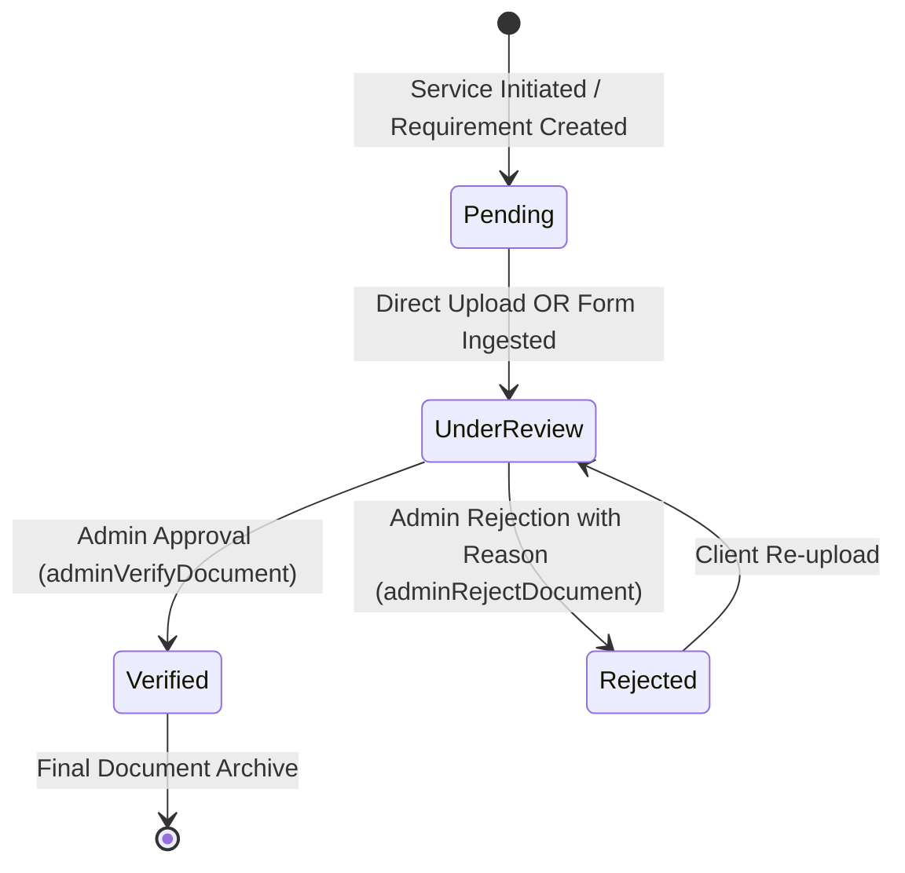

# Legal Sthal Document Pipeline & Verification Workflow Specification

**Version:** 2.1.0  
**Phase:** Step 6 — Document Pipeline & Verification Workflow  
**Database:** Google Sheets Schema V2 (`Documents`, `AuditLogs`, `Notifications`)  
**Storage Provider:** Google Drive API  
**Form Integration:** Google Forms Pre-filled Submissions & Webhook Ingestion  

---

## 1. Architecture Overview

The Legal Sthal Document Pipeline provides a secure, auditable, multi-tenant document collection and verification engine for legal service onboarding.

Documents can be submitted via two channels:
1. **Direct Web Upload:** Uploaded directly from the Client Portal via base64 encoded byte streams directly into dedicated Google Drive tenant folders.
2. **Dynamic Google Forms:** Pre-filled Google Forms accessible via web link or mobile QR code scanning, ingested via `onFormSubmit` triggers.

All submitted documents enter the **Verification Workflow** where Legal Operations administrators review, verify, or reject files with mandatory feedback reasons.

```text
                      DOCUMENT SUBMISSION CHANNELS
                      ┌───────────────────────────┐
                      │    Client Portal Upload   │
                      │  (Direct Base64 Stream)   │
                      └─────────────┬─────────────┘
                                    │
    ┌───────────────────────────────┼───────────────────────────────┐
    │                               │                               │
    ▼                               ▼                               ▼
┌─────────────────────────┐   ┌───────────┐   ┌───────────────────────────────┐
│ Dynamic QR / Form Link  │   │ Code.gs   │   │ Google Forms Submissions      │
│ (Prefilled Service/IDs) │   │ Web App   │   │ (onFormSubmit Apps Script)   │
└─────────────────────────┘   └─────┬─────┘   └───────────────┬───────────────┘
                                    │                         │
                                    ▼                         ▼
                      ┌───────────────────────────────────────────┐
                      │          PortalService.gs Core            │
                      │   - Client Folder Isolation (Drive)       │
                      │   - Under Review State Assignment         │
                      │   - AuditLogs Entry Generation            │
                      │   - Client Notification Dispatch          │
                      └─────────────────────┬─────────────────────┘
                                            │
                                            ▼
                      ┌───────────────────────────────────────────┐
                      │         Google Drive Tenant Storage       │
                      │   LegalSthal_Client_Documents/{clientId}/ │
                      └─────────────────────┬─────────────────────┘
                                            │
                                            ▼
                      ┌───────────────────────────────────────────┐
                      │       Admin Verification Workflow         │
                      │   ┌─────────────────┬─────────────────┐   │
                      │   │  adminVerify    │   adminReject   │   │
                      │   │  (Verified)     │   (Rejected +   │   │
                      │   │                 │    Reason)      │   │
                      │   └─────────────────┴─────────────────┘   │
                      └───────────────────────────────────────────┘
```

---

## 2. Google Drive Storage Architecture

### 2.1. Folder Hierarchy
Tenant separation is enforced at the Google Drive storage layer. Documents are never stored in a flat public directory:
```text
Google Drive Root
  └── LegalSthal_Client_Documents/
        ├── CL001/
        │     ├── PAN_Card_Director_1_DOC_1790926883535_2a357e515f12.pdf
        │     └── Electricity_Bill_DOC_1790926883536_3b468f626a13.pdf
        ├── CL002/
        │     └── ...
        └── CL003/
              └── ...
```

### 2.2. Folder Resolution (`getOrCreateClientDriveFolder`)
1. Searches for root folder named `LegalSthal_Client_Documents`. If missing, creates it.
2. Searches within root folder for subfolder named `{clientId}`. If missing, creates it.
3. Uploaded files are written directly into `{clientId}` folder with sanitized filenames and unique document identifiers.
4. Drive file metadata (`drive_file_id`, `file_url`) is captured and persisted to Schema V2 `Documents` sheet.

---

## 3. Database Schema V2: `Documents`

The `Documents` sheet adheres strictly to the Schema V2 specification:

| Column Index | Field Name | Data Type | Description |
|:---:|---|---|---|
| 1 | `document_id` | String | Unique primary key (e.g., `DOC_1790926883535_2a357e515f12`) |
| 2 | `service_id` | String | Foreign key to `Services` sheet (e.g., `SRV001`) |
| 3 | `client_id` | String | Foreign key to `Clients` sheet (e.g., `CL001`) |
| 4 | `document_name` | String | Business document name (e.g., "PAN Card of Director 1") |
| 5 | `document_type` | String | Document category (e.g., "Identity Proof", "Address Proof") |
| 6 | `form_response_id` | String | Google Forms submission response ID (if submitted via Form) |
| 7 | `file_name` | String | Original uploaded filename |
| 8 | `file_url` | String | Google Drive view URL |
| 9 | `drive_file_id` | String | Internal Google Drive file identifier |
| 10 | `status` | String | Lifecycle state: `Pending`, `Under Review`, `Verified`, `Rejected` |
| 11 | `rejection_reason` | String | Mandatory reviewer feedback if status is `Rejected` |
| 12 | `required` | Boolean | Whether document is mandatory for service processing |
| 13 | `uploaded_at` | ISO 8601 | Submission timestamp |
| 14 | `verified_at` | ISO 8601 | Admin verification timestamp (if status = `Verified`) |
| 15 | `verified_by` | String | Admin user name / email who verified the file |
| 16 | `rejected_at` | ISO 8601 | Admin rejection timestamp (if status = `Rejected`) |
| 17 | `rejected_by` | String | Admin user name / email who rejected the file |

---

## 4. Verification Workflow State Machine



### 4.1. State Transitions & Rules
1. **Initial Upload:**
   - Any document submission immediately sets `status = "Under Review"`.
   - Clears prior `rejection_reason`, `rejected_at`, and `rejected_by`.
   - Records audit event `UPLOAD_DOCUMENT`.
   - Sends client notification `DOCUMENT_SUBMITTED`.
2. **Verification (`adminVerifyDocument`):**
   - Restricted to `ADMIN` and `SUPER_ADMIN` roles.
   - Sets `status = "Verified"`.
   - Sets `verified_at = ISO timestamp` and `verified_by = session.adminName`.
   - Clears `rejection_reason`, `rejected_at`, and `rejected_by`.
   - Records audit event `VERIFY_DOCUMENT`.
   - Sends client notification `DOCUMENT_VERIFIED`.
3. **Rejection (`adminRejectDocument`):**
   - Restricted to `ADMIN` and `SUPER_ADMIN` roles.
   - Requires non-empty `rejection_reason` string (validated server-side; fails closed if omitted).
   - Sets `status = "Rejected"`.
   - Sets `rejected_at = ISO timestamp` and `rejected_by = session.adminName`.
   - Clears `verified_at` and `verified_by`.
   - Records audit event `REJECT_DOCUMENT`.
   - Sends high-priority client notification `DOCUMENT_REJECTED` containing the feedback reason.

---

## 5. Google Forms Prefill & Dynamic QR Code Specification

### 5.1. Prefill URL Format
Google Forms allows prefilling form fields via URL query parameters. The system dynamically formats prefilled URLs based on client and service context:
```text
https://docs.google.com/forms/d/e/{FORM_ID}/viewform?usp=pp_url&entry.1001={serviceId}&entry.1002={clientId}&entry.1003={clientEmail}
```

### 5.2. QR Code Generation
Dynamic QR codes are rendered using standard vector/raster QR encoding:
```text
https://api.qrserver.com/v1/create-qr-code/?size=250x250&data={ENCODED_PREFILL_URL}
```
Clients scanning this QR code from their mobile device are routed directly to the pre-filled form with their `service_id` and `client_id` locked in.

### 5.3. Webhook / `onFormSubmit` Ingestion
When a client completes the Google Form, the Apps Script trigger executes `onFormSubmit(e)`:
1. Extracts `service_id`, `client_id`, `doc_name`, and file attachment URLs from form responses.
2. Calls `PortalService.processFormSubmission()`.
3. Verifies that the service belongs to the stated client.
4. Appends a new record to `Documents` with `status = "Under Review"` and `form_response_id`.
5. Logs audit event `FORM_SUBMISSION_INGESTED`.
6. Dispatches client notification `DOCUMENT_SUBMITTED`.

---

## 6. API Route Contracts

### 6.1. Client Endpoints
- `POST { action: "getClientDocuments", sessionToken, service_id? }`
  - Returns sanitized documents list for owned services.
- `POST { action: "uploadDocument", sessionToken, service_id, document_name, document_type?, file_name, file_content_base64, mime_type? }`
  - Saves file to client Drive folder and registers in `Documents`.
- `POST { action: "getFormSubmissionConfig", sessionToken, service_id }`
  - Returns `form_url`, `prefilled_url`, `qr_code_url`, and `instructions`.

### 6.2. Operations Console Endpoints
- `POST { action: "adminGetDocuments", sessionToken, service_id?, client_id?, status? }`
  - Returns all system documents with optional filtering.
- `POST { action: "adminVerifyDocument", sessionToken, document_id }`
  - Transitions document to `Verified`.
- `POST { action: "adminRejectDocument", sessionToken, document_id, rejection_reason }`
  - Transitions document to `Rejected` with mandatory reason.

---

## 7. Security & Fail-Closed Guardrails

1. **Zero Client Spoofing:** In all client endpoints (`uploadDocument`, `getClientDocuments`, `getFormSubmissionConfig`), `client_id` is resolved from the active session. Any `client_id` in the request body is discarded.
2. **Fail-Closed IDOR Defense:** Attempting to upload or view documents for a foreign `service_id` returns `AUTH_FORBIDDEN` and logs the security violation.
3. **Admin Privilege Enforcement:** `adminVerifyDocument`, `adminRejectDocument`, and `adminGetDocuments` reject non-admin sessions with `AUTH_FORBIDDEN`.
4. **Mandatory Rejection Reason:** Document rejection fails closed with `A rejection reason is required.` if the reason is blank, whitespace, or missing.
5. **Zero Credential Exposure:** Documents API envelopes never leak user hashes, salts, or system credentials.
