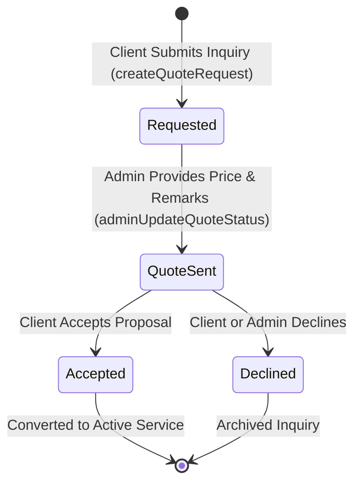

# Legal Sthal Zoho CRM Synchronization & Quote Requests Specification

**Version:** 2.1.0  
**Phase:** Step 7 — Zoho CRM Synchronization & Quote Requests  
**Database:** Google Sheets Schema V2 (`QuoteRequests`, `CRMSyncLogs`, `Services`, `AuditLogs`, `Notifications`)  
**External CRM:** Zoho CRM API v2 (`Leads`, `Deals`, `Accounts`)  
**Protocols:** OAuth 2.0 Refresh Flow, Resilient Asynchronous Queue, Idempotent Upsert  

---

## 1. System Architecture Overview

The Legal Sthal Zoho CRM Integration links the Netlify-hosted portal frontend with Google Sheets (Schema V2) and Zoho CRM as the external corporate source of truth for revenue, deals, and sales pipelines.

```text
       CLIENT ACTIONS                          ADMIN ACTIONS
┌───────────────────────────┐           ┌───────────────────────────┐
│ - Submit Quote Request    │           │ - Review Inquiries        │
│ - View Pricing Proposals  │           │ - Issue Official Proposals│
│ - Accept / Decline Quote  │           │ - Advance Workflow Stages │
└─────────────┬─────────────┘           └─────────────┬─────────────┘
              │                                       │
              ▼                                       ▼
┌───────────────────────────────────────────────────────────────────┐
│                     PortalService.gs Core                         │
│  - IDOR & Role Protection (SessionService)                       │
│  - Quote Lifecycle: Requested -> Quote Sent -> Accepted/Declined   │
│  - Client Notifications & AuditLogs Generation                    │
└─────────────────────────────────┬─────────────────────────────────┘
                                  │
                                  ▼
┌───────────────────────────────────────────────────────────────────┐
│                    CRMSyncService.gs Engine                       │
│  ┌────────────────────┐ ┌────────────────────┐ ┌────────────────┐ │
│  │ Lead Sync          │ │ Deal Stage Sync    │ │ Payment Sync   │ │
│  │ (Quote -> Lead)    │ │ (Service -> Deal)  │ │ (Paid/Pending) │ │
│  └─────────┬──────────┘ └─────────┬──────────┘ └───────┬────────┘ │
└────────────┼──────────────────────┼────────────────────┼──────────┘
             │                      │                    │
             ▼                      ▼                    ▼
┌───────────────────────────────────────────────────────────────────┐
│             Schema V2 CRMSyncLogs Table (Retry Queue)             │
│  [sync_id, entity_type, entity_id, crm_id, operation, status,    │
│   attempt_count, error_message, started_at, completed_at]        │
└─────────────────────────────────┬─────────────────────────────────┘
                                  │ UrlFetchApp (OAuth 2.0)
                                  ▼
┌───────────────────────────────────────────────────────────────────┐
│                          Zoho CRM API v2                          │
│        /Leads/upsert          /Deals/{id}          /Accounts      │
└───────────────────────────────────────────────────────────────────┘
```

---

## 2. Quote Requests & Proposals Workflow

### 2.1. Lifecycle State Machine



### 2.2. Schema V2: `QuoteRequests` Table Mapping

| Column Index | Field Name | Data Type | Description |
|:---:|---|---|---|
| 1 | `request_id` | String | Unique primary key (e.g., `QR_1790930986347_745b2297ff5c`) |
| 2 | `client_id` | String | Foreign key to `Clients` sheet (`CL001` or `PROSPECT`) |
| 3 | `client_name` | String | Company or individual name |
| 4 | `service_name` | String | Target service inquiry (e.g., "Trademark Registration") |
| 5 | `company_type` | String | Corporate structure (e.g., "Private Limited", "LLP") |
| 6 | `state` | String | Jurisdiction/State for filing |
| 7 | `mobile` | String | Primary contact phone number |
| 8 | `email` | String | Contact email address |
| 9 | `requested_on` | Date String | Submission date (e.g., "2026-10-02") |
| 10 | `status` | String | `Requested`, `Quote Sent`, `Accepted`, `Declined` |
| 11 | `quote_amount` | String | Quoted price string (e.g., "₹7,500 + Govt Fees") |
| 12 | `remarks` | String | Client inquiry notes or reviewer proposal remarks |

---

## 3. Zoho CRM Synchronization Engine

### 3.1. Entity Mapping & Operations

| Legal Sthal Entity | Trigger Event | Zoho CRM Module | Operation | Payload Fields |
|---|---|---|---|---|
| `QuoteRequests` | Quote created | `Leads` | `UPSERT_LEAD` | `Last_Name`, `Company`, `Email`, `Phone`, `State`, `Lead_Source`, `Description`, `Portal_Reference_ID` |
| `Services` | Admin advances stage | `Deals` | `UPDATE_DEAL_STAGE` | `Stage`, `Progress`, `Portal_Stage_Name` |
| `Services` | Payment updated | `Deals` | `SYNC_PAYMENT` | `Amount`, `Paid_Amount`, `Remaining_Amount` |

### 3.2. Stage Mapping Table
Portal service stages map directly to standardized Zoho CRM Deal stages:

| Portal Workflow Stage | Zoho CRM Deal Stage |
|---|---|
| `Document Collection` | `Lead Qualification` |
| `DSC Preparation` | `Proposal Sent` |
| `DIN Allotment` | `Under Processing` |
| `SPICe+ Part A Approval` | `Legal Drafting` |
| `SPICe+ Part B Preparation` | `Authority Submission` |
| `ROC Verification & Filing` | `Government Review` |
| `Certificate Issued` / `Completed` | `Closed Won` |

### 3.3. Schema V2: `CRMSyncLogs` Table Specification

| Column Index | Field Name | Data Type | Description |
|:---:|---|---|---|
| 1 | `sync_id` | String | Unique primary key (e.g., `SYNC_1790930986347_2s611y`) |
| 2 | `entity_type` | String | `QuoteRequest`, `Service`, `Client` |
| 3 | `entity_id` | String | ID of entity being synchronized (`QR001`, `SRV001`, `CL001`) |
| 4 | `crm_id` | String | Zoho Lead ID (`ZL-XXXXX`) or Deal ID (`ZC-XXXXX`) |
| 5 | `operation` | String | `UPSERT_LEAD`, `UPDATE_DEAL_STAGE`, `SYNC_PAYMENT` |
| 6 | `status` | String | `Synced`, `Failed`, `Pending Retry` |
| 7 | `attempt_count` | Integer | Number of synchronization attempts executed |
| 8 | `error_message` | String | Diagnostic error response from upstream Zoho API |
| 9 | `started_at` | ISO 8601 | Initial synchronization initiation timestamp |
| 10 | `completed_at` | ISO 8601 | Completion timestamp (when status transitions to `Synced`) |
| 11 | `next_retry_at` | ISO 8601 | Scheduled automatic retry timestamp |

---

## 4. Operational Monitoring & Failure Recovery

### 4.1. Health Metric Aggregation
`CRMSyncService.getCrmSyncOverview()` computes operational metrics displayed in the Admin Console:
- **`status`:** `"Healthy"` if `failedRecords === 0`, else `"Degraded"`.
- **`lastSyncTime`:** Formatted timestamp of the most recent sync attempt.
- **`successfulRecords`:** Total count of records with `status === "Synced"`.
- **`failedRecords`:** Total count of records requiring attention (`Failed` or `Pending Retry`).

### 4.2. Manual Single-Record Retry (`adminRetryCrmSync`)
1. Operations admin identifies a `Failed` record in the transaction table.
2. Clicking **Retry Sync** calls `adminRetryCrmSync({ syncId })`.
3. Backend fetches the original entity, increments `attempt_count`, re-executes the API call, and updates status to `Synced`.
4. Writes an immutable audit entry in `AuditLogs` (`RETRY_CRM_SYNC`).

### 4.3. Batch Force Sync (`adminTriggerForceSync`)
1. Admin triggers **Trigger Force Sync**.
2. Scans `CRMSyncLogs` for all pending or failed entries and replays the synchronization queue.
3. Returns count of successfully processed retries and updated health overview.

---

## 5. Security & IDOR Defenses

1. **Client Identity Resolution:** Client quote submissions and retrievals resolve `clientId` strictly from the session token. Client parameter tampering is ignored.
2. **Cross-Tenant Isolation:** Clients requesting `getClientQuoteRequests` receive only quotes where `client_id === session.clientId`. Foreign quotes are never returned.
3. **Role Authorization:** Only `ADMIN` and `SUPER_ADMIN` roles can access `adminGetQuoteRequests`, `adminUpdateQuoteStatus`, `adminGetCrmSync`, `adminRetryCrmSync`, and `adminTriggerForceSync`. Non-admin sessions receive `AUTH_FORBIDDEN`.
4. **Validation Fail-Closed:** Quote creation requires non-empty `serviceName`. Quote status updates require valid status values (`Requested`, `Quote Sent`, `Accepted`, `Declined`).
5. **Zero Credential Exposure:** Zoho client secrets, refresh tokens, and internal database keys are isolated in `ScriptProperties` and never returned in API payloads.
